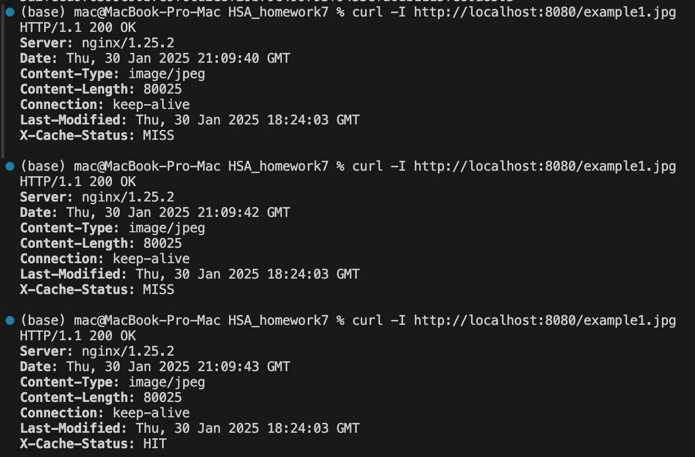
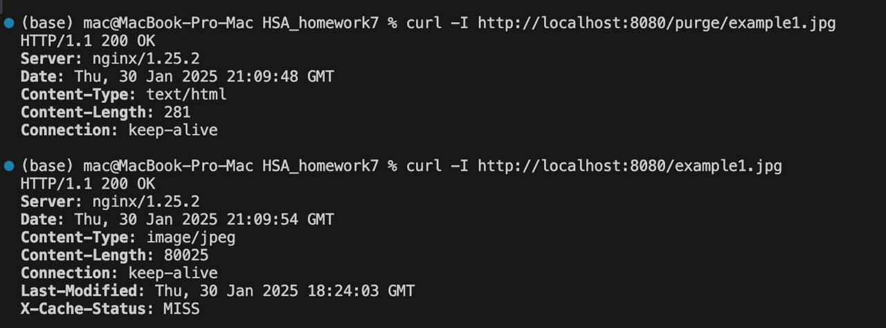

1.	This Docker container runs Alpine Linux with both Python3 and a custom-built NGINX (including the ngx_cache_purge module).
2.	Python is started on port 8001 inside the container, serving static files from /usr/share/nginx/html.
3.	NGINX listens on port 80 and proxies all requests to 127.0.0.1:8001 (the local Python server).
4.	NGINX is configured so that images (.jpg, .png, etc.) are only cached on the second request—this makes the first request a MISS, and the second request a HIT.
5.	A special purge location /purge/... is used to remove a single cached file, causing the subsequent request to become a MISS again.

# Logs

To purge the cached file, send a request to the special /purge/<filename> path:

# Purge
